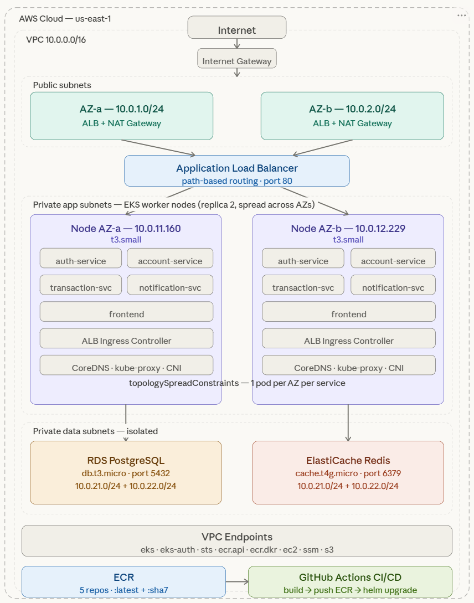

# 🏦 NovaPay — AWS EKS Deployment

> Hands-on project deploying a banking microservices system on AWS — practicing EKS, core AWS services, and CI/CD automation in a production-like environment.

---

## Table of Contents

- [1. Overview](#1-overview)
  - [1.1 About NovaPay](#11-about-novapay)
  - [1.2 Tech Stack](#12-tech-stack)
  - [1.3 Architecture](#13-architecture)
  - [1.4 Services & Flow](#14-services--flow)
- [2. Prerequisites](#2-prerequisites)
  - [2.1 Tools](#21-tools)
  - [2.2 AWS Setup](#22-aws-setup)
  - [2.3 Required AWS Resources](#23-required-aws-resources)
- [3. Infrastructure Setup](#3-infrastructure-setup)
  - [3.1 VPC & Networking](#31-vpc--networking)
  - [3.2 Security Groups](#32-security-groups)
  - [3.3 EKS Cluster](#33-eks-cluster)
  - [3.4 RDS PostgreSQL](#34-rds-postgresql)
  - [3.5 ElastiCache Redis](#35-elasticache-redis)
- [4. Deployment](#4-deployment)
  - [4.1 Chuẩn bị Helm chart](#41-chuẩn-bị-helm-chart)
  - [4.2 Deploy lên EKS](#42-deploy-lên-eks)
  - [4.3 ALB Ingress Controller](#43-alb-ingress-controller)
- [5. CI/CD](#5-cicd)
  - [5.1 GitHub Secrets Setup](#51-github-secrets-setup)
  - [5.2 Pipeline Overview](#52-pipeline-overview)
- [6. Architecture Decisions](#6-architecture-decisions)
  - [6.1 ALB vs Nginx Proxy](#61-alb-vs-nginx-proxy)
  - [6.2 VPC Endpoints](#62-vpc-endpoints)
  - [6.3 Vấn đề gặp phải & cách giải quyết](#63-vấn-đề-gặp-phải--cách-giải-quyết)

## 1. Overview

### 1.1 About NovaPay

NovaPay là dự án microservices ngân hàng được triển khai trên AWS nhằm rèn luyện kỹ năng xây dựng và vận hành hệ thống cloud trong thực tế. Dự án hướng đến việc triển khai end-to-end, từ hạ tầng đến ứng dụng, kết hợp các dịch vụ AWS và quy trình CI/CD trong môi trường gần với production.

### 1.2 Tech Stack

**Backend:** Node.js · TypeScript · Express · Prisma · PostgreSQL · Redis · Socket.io

**Frontend:** React · Vite · TailwindCSS · Nginx

**Infrastructure:** AWS EKS · RDS · ElastiCache · ALB · ECR · Helm · GitHub Actions

### 1.3 Architecture

Hệ thống được triển khai trên AWS theo mô hình 3-tier, toàn bộ nằm trong một VPC riêng biệt tại region us-east-1.

Traffic từ internet đi qua **ALB** (Application Load Balancer) — đây là điểm vào duy nhất của hệ thống, thực hiện path-based routing để điều hướng request đến đúng service. Các **EKS worker nodes** chạy trong private subnets, không expose trực tiếp ra internet, chỉ nhận traffic từ ALB. Database (**RDS PostgreSQL**) và cache (**ElastiCache Redis**) nằm trong data subnets hoàn toàn isolated — chỉ các nodes trong app subnets mới kết nối được.

Để nodes trong private subnets có thể pull image từ ECR và giao tiếp với AWS APIs mà không cần ra internet, hệ thống sử dụng **VPC Endpoints** làm cầu nối nội bộ.

> **Lưu ý:** Theo đúng nguyên tắc microservices, mỗi service nên có database riêng biệt (Database per Service pattern) để đảm bảo loose coupling và independent deployment. Tuy nhiên trong project này, tất cả services dùng chung một RDS instance, phân tách bằng PostgreSQL schemas (`auth`, `account`, `transaction`, `notification`) — để đơn giản hóa việc setup và tập trung vào thực hành EKS/DevOps hơn là database architecture.



### 1.4 Services & Flow

Xem chi tiết tại [ARCHITECTURE.md](ARCHITECTURE.md/)

**Nhiệm vụ từng service:**

| Service              | Port | Nhiệm vụ                                              |
| -------------------- | ---- | ----------------------------------------------------- |
| auth-service         | 3001 | Đăng ký, đăng nhập, JWT, token blacklist              |
| account-service      | 3002 | Quản lý số dư, cache Redis, internal transfer         |
| transaction-service  | 3003 | Orchestrate flow chuyển tiền end-to-end               |
| notification-service | 3004 | Real-time notifications qua WebSocket + Redis pub/sub |

## 2. Prerequisites

### 2.1 Tools

| Tool    | Version | Purpose                               |
| ------- | ------- | ------------------------------------- |
| AWS CLI | v2+     | Quản lý AWS resources                 |
| kubectl | v1.34+  | Quản lý Kubernetes cluster            |
| eksctl  | latest  | Tạo EKS cluster, IAM service accounts |
| helm    | v3+     | Deploy ứng dụng lên EKS               |
| docker  | latest  | Build và push images                  |
| git     | latest  | Quản lý source code                   |

### 2.2 AWS Setup

Cần có AWS account với IAM user đã được cấp quyền **AdministratorAccess** để thuận tiện trong quá trình setup.

> **Best practice:** Trong môi trường production, nên tạo IAM user riêng với quyền tối thiểu (least privilege) — chỉ cấp đúng những permissions cần thiết cho từng tác vụ thay vì AdministratorAccess.

Cấu hình AWS CLI:

```bash
aws configure
# AWS Access Key ID: <your-key>
# AWS Secret Access Key: <your-secret>
# Default region: us-east-1
# Default output format: json
```

Verify:

```bash
aws sts get-caller-identity
```

### 2.3 Required AWS Resources

Trước khi bắt đầu, cần tạo sẵn các IAM roles:

| Role                 | Policy                                                                                |
| -------------------- | ------------------------------------------------------------------------------------- |
| AmazonEKSClusterRole | AmazonEKSClusterPolicy                                                                |
| AmazonEKSNodeRole    | AmazonEKSWorkerNodePolicy · AmazonEC2ContainerRegistryReadOnly · AmazonEKS_CNI_Policy |

> **Lưu ý:** AmazonEKSClusterRole cần thêm inline policy `EKSDescribeInstances` với các actions `ec2:DescribeInstances`, `ec2:DescribeNetworkInterfaces`, `ec2:DescribeVpcs`, `ec2:DescribeDhcpOptions`, `ec2:DescribeAvailabilityZones` — cần thiết cho Kubernetes 1.33+.

## 3. Infrastructure Setup

### 3.1 VPC & Networking

Tạo VPC với kiến trúc 3-tier, trải đều 2 AZ để đảm bảo high availability.

| Subnet            | CIDR         | AZ         | Mục đích         |
| ----------------- | ------------ | ---------- | ---------------- |
| novapay-public-1a | 10.0.1.0/24  | us-east-1a | ALB, NAT Gateway |
| novapay-public-1b | 10.0.2.0/24  | us-east-1b | ALB, NAT Gateway |
| novapay-app-1a    | 10.0.11.0/24 | us-east-1a | EKS Worker Nodes |
| novapay-app-1b    | 10.0.12.0/24 | us-east-1b | EKS Worker Nodes |
| novapay-data-1a   | 10.0.21.0/24 | us-east-1a | RDS, ElastiCache |
| novapay-data-1b   | 10.0.22.0/24 | us-east-1b | RDS, ElastiCache |

```bash
# Tạo VPC
VPC_ID=$(aws ec2 create-vpc \
  --cidr-block 10.0.0.0/16 \
  --query 'Vpc.VpcId' --output text)

aws ec2 modify-vpc-attribute --vpc-id $VPC_ID --enable-dns-support
aws ec2 modify-vpc-attribute --vpc-id $VPC_ID --enable-dns-hostnames
aws ec2 create-tags --resources $VPC_ID --tags Key=Name,Value=novapay-vpc
```

Tạo Internet Gateway, 2 NAT Gateways (1 per AZ) và route tables tương ứng:

- Public subnets → Internet Gateway
- App subnets → NAT Gateway (mỗi AZ dùng NAT riêng)
- Data subnets → isolated, không có route ra internet

### 3.2 Security Groups

| Security Group        | Inbound                                  |
| --------------------- | ---------------------------------------- |
| novapay-sg-alb        | 80, 443 from 0.0.0.0/0                   |
| eks-cluster-sg (auto) | 80, 443, 30000-32767, 3001-3004 from ALB |
| novapay-sg-rds        | 5432 from eks-cluster-sg                 |
| novapay-sg-redis      | 6379 from eks-cluster-sg                 |
| novapay-sg-endpoints  | 443 from app subnets                     |

> **Lưu ý:** Security Group cho EKS nodes (`eks-cluster-sg-*`) được AWS tự động tạo khi tạo cluster — không cần tạo thủ công.

### 3.3 EKS Cluster

**Quan trọng — thứ tự tạo:**

```
1. Tạo EKS cluster (control plane)
2. Tạo VPC Endpoints
3. Tạo aws-auth ConfigMap
4. Tạo Node Group
```

Lý do phải theo thứ tự này: nodes trong private subnets cần VPC Endpoints để reach AWS APIs ngay khi bootstrap. Nếu tạo node group trước endpoints, nodes sẽ không join được cluster.

**VPC Endpoints cần tạo:**

| Endpoint                         | Type      | Mục đích                   |
| -------------------------------- | --------- | -------------------------- |
| com.amazonaws.us-east-1.eks      | Interface | Node đăng ký vào cluster   |
| com.amazonaws.us-east-1.eks-auth | Interface | Xác thực với control plane |
| com.amazonaws.us-east-1.sts      | Interface | Lấy IAM credentials        |
| com.amazonaws.us-east-1.ecr.api  | Interface | Pull Docker images         |
| com.amazonaws.us-east-1.ecr.dkr  | Interface | Pull Docker images         |
| com.amazonaws.us-east-1.ec2      | Interface | Node describe metadata     |
| com.amazonaws.us-east-1.ssm      | Interface | Bootstrap script           |
| com.amazonaws.us-east-1.s3       | Gateway   | Pull EKS bootstrap files   |

**Cấu hình cluster:**

| Parameter          | Value                 |
| ------------------ | --------------------- |
| Kubernetes version | 1.34                  |
| Node type          | t3.small              |
| Node count         | 2 (min 2, max 3)      |
| AMI                | Amazon Linux 2023     |
| Auth mode          | EKS API and ConfigMap |
| Endpoint access    | Public and Private    |

**Vấn đề gặp phải khi tạo Node Group:**

Nodes không join được cluster với lỗi `NodeCreationFailure: Instances failed to join the kubernetes cluster`.

Nguyên nhân: `AmazonEKSClusterPolicy` mặc định thiếu permission `ec2:DescribeInstances` với Kubernetes 1.33+. EKS dùng permission này để query private DNS của node khi authenticate.

Fix: Thêm inline policy vào `AmazonEKSClusterRole`:

```bash
aws iam put-role-policy \
  --role-name AmazonEKSClusterRole \
  --policy-name EKSDescribeInstances \
  --policy-document file://eks-policy.json
```

```json
{
  "Version": "2012-10-17",
  "Statement": [
    {
      "Effect": "Allow",
      "Action": [
        "ec2:DescribeInstances",
        "ec2:DescribeNetworkInterfaces",
        "ec2:DescribeVpcs",
        "ec2:DescribeDhcpOptions",
        "ec2:DescribeAvailabilityZones"
      ],
      "Resource": "*"
    }
  ]
}
```

### 3.4 RDS PostgreSQL

```bash
aws rds create-db-instance \
  --db-instance-identifier novapay-db \
  --db-instance-class db.t3.micro \
  --engine postgres \
  --engine-version 16.6 \
  --master-username novapay \
  --master-user-password <password> \
  --allocated-storage 20 \
  --db-name novapay \
  --vpc-security-group-ids <sg-rds-id> \
  --db-subnet-group-name novapay-db-subnet \
  --no-multi-az \
  --no-publicly-accessible
```

| Parameter | Value             |
| --------- | ----------------- |
| Engine    | PostgreSQL 17.6   |
| Instance  | db.t3.micro       |
| Storage   | 20 GiB gp2        |
| Multi-AZ  | No                |
| Subnet    | data-1a + data-1b |

### 3.5 ElastiCache Redis

```bash
aws elasticache create-replication-group \
  --replication-group-id novapay-redis \
  --replication-group-description "NovaPay Redis" \
  --num-cache-clusters 1 \
  --cache-node-type cache.t4g.micro \
  --engine redis \
  --engine-version 7.1 \
  --cache-subnet-group-name novapay-redis-subnet \
  --security-group-ids <sg-redis-id> \
  --no-transit-encryption-enabled \
  --no-at-rest-encryption-enabled
```

| Parameter    | Value             |
| ------------ | ----------------- |
| Engine       | Redis 7.1         |
| Node type    | cache.t4g.micro   |
| Cluster mode | Disabled          |
| TLS          | Disabled          |
| Subnet       | data-1a + data-1b |

## 4. Deployment

### 4.1 Chuẩn bị Helm chart

Helm chart được cấu hình để chạy được trên cả local (Bitnami PostgreSQL/Redis) lẫn AWS (RDS/ElastiCache) mà không cần sửa code.

**Cấu trúc:**

```
helm/novapay/
├── Chart.yaml
├── values.yaml          ← config local (Bitnami)
├── values-aws.yaml      ← config AWS (RDS + ElastiCache)
└── templates/
    ├── configmap.yaml
    ├── secret.yaml
    ├── namespace.yaml
    ├── auth-service/
    ├── account-service/
    ├── transaction-service/
    ├── notification-service/
    └── frontend/
        ├── deployment.yaml
        ├── service.yaml
        └── ingress.yaml
```

Deployment templates sử dụng conditional để tự động chọn host:

```yaml
DATABASE_URL: "postgresql://...@{{ .Values.postgres.auth.host |
  default (printf "%s-postgres" .Release.Name) }}:5432/..."

REDIS_URL: "redis://:...@{{ .Values.redis.host |
  default (printf "%s-redis-master" .Release.Name) }}:6379"
```

Tạo file `values-aws.yaml` với config thực tế:

```yaml
imageRegistry: <account_id>.dkr.ecr.us-east-1.amazonaws.com/novapay

postgres:
  enabled: false
  auth:
    username: novapay
    password: <password>
    database: novapay
    host: <rds-endpoint>

redis:
  enabled: false
  auth:
    password: ""
  host: <elasticache-endpoint>
```

### 4.2 Deploy lên EKS

```bash
# Update kubeconfig
aws eks update-kubeconfig --region us-east-1 --name novapay

# Grant admin access cho IAM user
aws eks create-access-entry \
  --cluster-name novapay \
  --principal-arn arn:aws:iam::<account_id>:user/novapay-admin \
  --type STANDARD

aws eks associate-access-policy \
  --cluster-name novapay \
  --principal-arn arn:aws:iam::<account_id>:user/novapay-admin \
  --policy-arn arn:aws:eks::aws:cluster-access-policy/AmazonEKSClusterAdminPolicy \
  --access-scope type=cluster

# Deploy
helm upgrade --install novapay helm/novapay \
  -f helm/novapay/values-aws.yaml \
  --namespace novapay \
  --create-namespace \
  --wait --timeout 5m
```

Verify:

```bash
kubectl get pods -n novapay
kubectl get services -n novapay
```

### 4.3 ALB Ingress Controller

ALB Ingress Controller là thành phần cầu nối giữa Kubernetes Ingress resource và AWS ALB. Khi tạo Ingress, controller tự động gọi AWS API để tạo ALB, target groups và listeners tương ứng.

```bash
# 1. Tạo IAM Policy
aws iam create-policy \
  --policy-name AWSLoadBalancerControllerIAMPolicy \
  --policy-document file://alb-policy.json

# 2. Enable OIDC provider
eksctl utils associate-iam-oidc-provider \
  --cluster novapay --approve

# 3. Tạo IAM Service Account
eksctl create iamserviceaccount \
  --cluster novapay \
  --namespace kube-system \
  --name aws-load-balancer-controller \
  --attach-policy-arn arn:aws:iam::<account_id>:policy/AWSLoadBalancerControllerIAMPolicy \
  --approve

# 4. Cài ALB Controller
helm repo add eks https://aws.github.io/eks-charts
helm upgrade --install aws-load-balancer-controller eks/aws-load-balancer-controller \
  -n kube-system \
  --set clusterName=novapay \
  --set serviceAccount.create=false \
  --set serviceAccount.name=aws-load-balancer-controller \
  --set vpcId=<vpc-id> \
  --set region=us-east-1
```

Ingress configuration:

```yaml
annotations:
  kubernetes.io/ingress.class: alb
  alb.ingress.kubernetes.io/scheme: internet-facing
  alb.ingress.kubernetes.io/target-type: ip
  alb.ingress.kubernetes.io/subnets: <public-subnet-1a>,<public-subnet-1b>
  alb.ingress.kubernetes.io/security-groups: <alb-sg-id>
  alb.ingress.kubernetes.io/listen-ports: '[{"HTTP":80}]'
  alb.ingress.kubernetes.io/healthcheck-path: /health
  alb.ingress.kubernetes.io/success-codes: "200,404"
```

Sau khi deploy, lấy ALB URL:

```bash
kubectl get ingress -n novapay
```

## 5. CI/CD

### 5.1 GitHub Secrets Setup

Tạo AWS credentials cho GitHub Actions:

```bash
aws iam create-access-key --user-name novapay-admin
```

Thêm vào GitHub repo → Settings → Secrets → Actions:

| Secret                  | Value                        |
| ----------------------- | ---------------------------- |
| `AWS_ACCESS_KEY_ID`     | AccessKeyId từ lệnh trên     |
| `AWS_SECRET_ACCESS_KEY` | SecretAccessKey từ lệnh trên |
| `AWS_REGION`            | us-east-1                    |

### 5.2 Pipeline Overview

Pipeline tự động trigger khi có thay đổi trong `services/**` hoặc `frontend/**`.

```
Push code lên main
        │
        ▼
Job 1: Detect Changes
→ Phát hiện service nào thay đổi
→ Chỉ build những service cần thiết
        │
        ▼
Job 2: Typecheck (song song)
→ Kiểm tra lỗi TypeScript trước khi build
→ Fail fast — phát hiện lỗi sớm
        │
        ▼
Job 3: Build & Push ECR (song song)
→ Build Docker image
→ Tag: :latest + :<git-sha-7>
→ Push lên ECR
        │
        ▼
Job 4: Deploy to EKS
→ helm upgrade với image tag mới
→ Kubernetes rolling update — zero downtime
→ Verify rollout
        │
        ▼
Job 5: Summary
→ Báo cáo kết quả toàn bộ pipeline
```

**Image tagging strategy:**

Mỗi image được push với 2 tags:

- `:latest` — luôn trỏ vào version mới nhất
- `:<git-sha-7>` — tag cố định theo commit, dùng để rollback chính xác

```bash
# Rollback về version cụ thể
helm upgrade novapay helm/novapay \
  -f helm/novapay/values-aws.yaml \
  --namespace novapay \
  --set services.auth.tag=<git-sha>
```

**Rolling update flow:**

```
helm upgrade → EKS nhận deployment mới
        │
        ▼
Kubernetes so sánh image tag cũ vs mới
        │
        ▼
Tạo pod mới → chờ readinessProbe pass
        │
        ▼
Chuyển traffic sang pod mới
        │
        ▼
Xóa pod cũ → zero downtime
```

## 6. Architecture Decisions

### 6.1 ALB vs Nginx Proxy

**Kiến trúc ban đầu:**

```
Internet → ALB → Frontend (Nginx) → Backend services
```

Nginx đóng vai trò API Gateway — nhận toàn bộ traffic rồi proxy_pass đến từng service. Cách này hoạt động được nhưng có một số vấn đề:

- Mọi request đều phải đi qua thêm 1 hop (Nginx) trước khi đến backend
- Frontend pod trở thành điểm nghẽn cổ chai — scale frontend = scale gateway
- Nginx pod chết = toàn bộ API chết, dù backend vẫn đang chạy bình thường

**Kiến trúc sau khi cải thiện:**

```
Internet → ALB (path-based routing) → Backend services
                                    → Frontend (static only)
```

ALB đảm nhận vai trò API Gateway thông qua path-based routing, forward traffic trực tiếp đến đúng service. Nginx chỉ còn nhiệm vụ serve static files.

Không cần sửa code frontend vì frontend gọi API qua relative URL (`baseURL: '/api'`) — ALB tự routing đến đúng service mà frontend không cần biết.

### 6.2 VPC Endpoints

Nodes chạy trong private subnets — không có đường ra internet trực tiếp. Tuy nhiên nodes cần gọi các AWS APIs (ECR để pull image, STS để lấy credentials...) trong quá trình bootstrap.

Thay vì để traffic đi qua NAT Gateway ra internet rồi mới đến AWS APIs:

```
Node → NAT Gateway → Internet → AWS API   (tốn tiền, chậm)
```

VPC Endpoints tạo đường đi nội bộ trong AWS network:

```
Node → VPC Endpoint → AWS API   (nhanh hơn, rẻ hơn, bảo mật hơn)
```

Đây cũng là nguyên nhân chính gây lỗi `NodeCreationFailure` nếu thiếu endpoints — nodes boot lên nhưng không reach được EKS API để join cluster.

### 6.3 Vấn đề gặp phải & cách giải quyết

| Vấn đề                  | Nguyên nhân                                                        | Giải pháp                                          |
| ----------------------- | ------------------------------------------------------------------ | -------------------------------------------------- |
| `NodeCreationFailure`   | `AmazonEKSClusterRole` thiếu `ec2:DescribeInstances` với K8s 1.33+ | Thêm inline policy `EKSDescribeInstances` vào role |
| ALB target unhealthy    | Security Group chưa allow port 3001-3004 từ ALB vào nodes          | Thêm inbound rules cho từng service port           |
| Pods `CrashLoopBackOff` | Sai password RDS trong `values-aws.yaml`                           | Kiểm tra lại credentials                           |
| Helm namespace error    | Namespace tạo thủ công thiếu Helm metadata                         | Label + annotate namespace trước khi deploy        |
| ALB 504 timeout         | Health check path không tồn tại                                    | Thêm annotation `healthcheck-path: /health`        |
